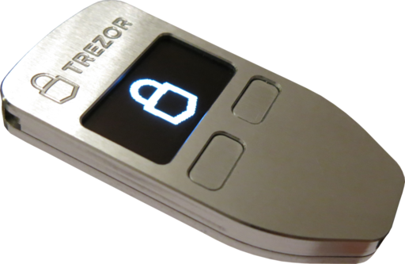
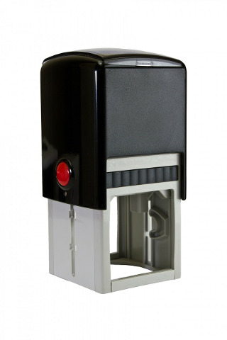
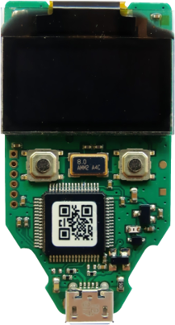

Overview
========

What is BWallet?
---------------

BWallet is a single purpose device which allows you to make secure Bitcoin transactions. With BWallet, transactions are completely safe even when initiated on a compromised or vulnerable computer.  Because the use of BWallet is very easy and intuitive we believe it will help Bitcoin adoption among common people.

How does BWallet work?
---------------------

The Bitcoin protocol works by sending signed notes of payment across the Internet.  These messages(which are referred to as Transactions) are signed using a special algorithm.  In order to sign a Bitcoin transaction you need to have a special key or password.  BWallet holds that key.  Since BWallet's job is to help you securely sign Transaction messages, you can think of you BWallet as a modern day stamp.

(image credit  `Petr Kvashin <http://www.publicdomainpictures.net/view-image.php?image=038943>`_)

BWallet is better than an ordinary mechanical stamping mechanism, however.  Each BWallet has a PIN code. If your BWallet gets stolen, thieves cannot misuse it to steal your money.  Due to BWallet's clever design, even if the computer with which you use your BWallet is hacked, the hackers will never know your PIN.

In contrast to the various pieces of software and web services that allow you to store your Bitcoins BWallet is secure.  Software and web based solutions keep your Bitcoin signing keys either on your computer, or worse, on the Internet!  When you use such a service, hackers can easily steal your Bitcoins by hacking your computers or hacking the servers of the services that you use.

Which operating systems and devices support BWallet?
---------------------------------------------------

There is full support in Windows, OS X and Linux.  Support for using your BWallet with Android devices which have USB On-The-Go (aka USB Host) support is planned in a future release.

What kind of hardware specs does the BWallet have?
-------------------------------------------------

**CPU**
  BWallet is using a 120 MHz embedded ARM processor (Cortex M3 to be precise) with a custom developed system.

**Screen**
  Bright OLED - 128x64 pixels.  Enough to hold six lines of text.  Can display all the details you need to verify a transaction in a single screenfull.

**Case**
  Both BWallet Classic and BWallet Metallic will have a similar case with dimensions of approx. 60 x 30 x 6 mm. The Classic edition is made of a reinforced plastic providing great durability. The Metallic BWallet is made of a polished CNC milled aluminum.

**Safety and certifications**
  The BWallet is CE and RoHS certified, so it meets all quality, reliability and environmental standards.  Its fine to take your BWallet with you on the airplane.  Like all modern electronics, the X-Rays won't hurt it.

**Operating temperature**
  -20°C to +60°C (-4°F - +140°F)

What if I lose my BWallet?
-------------------------

BWallet comes with excellent support for paper wallets.  When you set up your BWallet for the first time you will be told a list of secret words to write down.  Once you have written down this list, you can recover your Bitcoins at any time using a replacement BWallet.

Which wallets are compatible with BWallet?
-----------------------------------------

- `MyBWallet <http://www.mytrezor.com>`_ - full support
- `MyBWallet Lite (Android) <https://play.google.com/store/apps/details?id=com.satoshilabs.btcreceive>`_ - allows to import xpub + watch only mode
